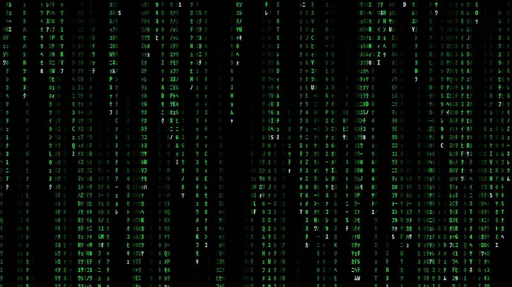
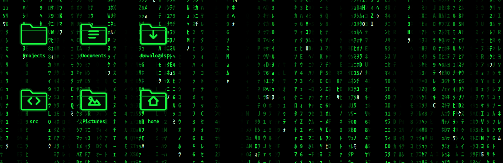
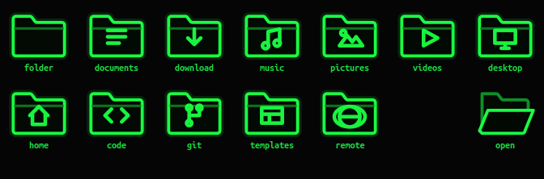
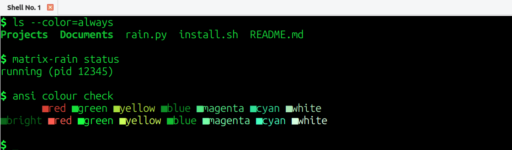

# matrix-desktop

A complete Matrix-style desktop for **Lubuntu / LXQt + Openbox on X11**: a real
animated wallpaper, Tron-green folder icons, and matching panel, window, menu
and terminal themes.

Built and tuned on Lubuntu 25.10 (LXQt 2.2, Openbox, picom, X11).



---

## Install

You don't need to know anything about how themes work. Clone it and run one
script:

```bash
git clone https://github.com/tzarz/matrix-desktop.git
cd matrix-desktop
./install.sh
```

That's it. The installer checks your dependencies, builds the themes, installs
everything into your home directory and applies it. **No root required** — it
never touches anything outside `$HOME`.

Before it changes any setting, it copies the original to
`~/.matrix-desktop-backup-<timestamp>/`. To undo everything:

```bash
./uninstall.sh
```

### Options

```bash
./install.sh --no-apply             # install the files, change no settings
./install.sh --exclude "HDMI-1"     # never draw the wallpaper on that output
./uninstall.sh --keep-config        # remove the theme, keep your settings
```

### Dependencies

```bash
sudo apt install python3-gi gir1.2-gtk-3.0 python3-cairo papirus-icon-theme \
                 lxqt-themes fonts-noto-cjk xscreensaver-gl x11-xserver-utils
```

The installer checks every one of these and stops with a clear message listing
anything missing, so you can run it first and see what you need.

---

## What you get

| Piece | What it is |
|---|---|
| **Live wallpaper** | Flat 2D katakana/latin/digit rain. Transparent, click-through, CPU-only. |
| **Icon theme** | `Papirus-Matrix` — hand-drawn Tron folders + recoloured monochrome icons. |
| **LXQt theme** | `Matrix` — phosphor-green panel, menus, runner and notifications. |
| **Openbox theme** | `Matrix` — green-on-black titlebars, borders and menus. |
| **Terminal** | `Matrix` colour scheme for QTerminal. |
| **Desktop labels** | Green bold monospace on black. |
| **Screensaver** | XScreenSaver configured to GLMatrix only. |

### Desktop



*Composite: the real rain render with the real folder icons and the real label
styling (Ubuntu Mono Bold, `#19FF42` on `#001A05` shadow) drawn over it. Because
the wallpaper window is genuinely transparent, this is what you actually see.*

### Folder icons



Drawn from scratch as SVG line art — near-black body, phosphor-green outline, a
faint glow, and a glyph per folder type. Papirus ships green folders, but they
are a muted olive (`#87b158`) that does not read as "Matrix", so these are not
recoloured Papirus icons.

App and mimetype icons are deliberately **left alone** so your applications stay
recognisable. Only folders and the monochrome action/status/panel icons change.

### Terminal



Mostly phosphor green, but red and amber are kept recognisable so error output,
git diffs and `ls` colours stay readable. A fully monochrome palette looks great
in a screenshot and is miserable to work in.

> QTerminal rewrites its config when it exits, so if a terminal is open while
> you install, the installer will not change its setting — it tells you to pick
> **Preferences → Appearance → Color scheme → Matrix** instead. The scheme file
> is installed either way.

### Panel


---

## Using the wallpaper

```bash
matrix-rain start          # also: stop, restart, toggle, status
matrix-rain start --wait   # wait for the monitor layout to settle (used at login)
```

It autostarts at login via `~/.config/autostart/matrix-rain.desktop`.

Tuning lives in `~/.config/matrix-rain.conf`:

```sh
EXCLUDE=""                 # xrandr outputs that must never show the wallpaper
RAIN_OPTS="--fps 3 --size 18 --density 0.60 --trail-min 4 --trail-max 56 \
           --speed-min 0.625 --speed-max 2.0 --mutate 0.8 --bg-alpha 0.0"
```

Useful options: `--mix katakana,digits,latin,symbols`, `--bg-alpha` (0 = fully
transparent, 1 = solid black backdrop), `--levels`, `--fade-gamma`, `--font`,
`--window-type normal`.

### Excluding a display

`EXCLUDE` is a space-separated list of xrandr output names that must never be
drawn on. Use it when a display is not a desktop: a capture card, a projector,
or a scientific instrument. This project grew on a machine where one HDMI output
drives a **spatial light modulator**, which must show only its phase pattern —
anything composited over it corrupts the experiment.

```sh
EXCLUDE="HDMI-0 DP-3"
```

---

## How the wallpaper actually works

Three things make this a *real* live background rather than a window sitting on
your screen.

**1. It is a desktop-type window, not a root-window drawing.**
The classic trick — `glmatrix -root`, `xsetroot` — does not work on LXQt.
`pcmanfm-qt --desktop` owns a window covering the entire root, so anything
painted on the root is invisible behind it. Instead the renderer declares
`_NET_WM_WINDOW_TYPE_DESKTOP`, the EWMH property meaning "this window *is* the
desktop background". That is the same mechanism pcmanfm-qt, Nautilus, xfdesktop
and xwinwrap use, and every EWMH-compliant window manager honours it.

Setting only `_NET_WM_STATE_BELOW` is **not** enough: Openbox keeps
`_NET_WM_WINDOW_TYPE_NORMAL` windows above the desktop layer regardless, and
neither `wmctrl -b add,below` nor `xdotool windowlower` overrides it. The window
type is the fix.

**2. It is transparent, so your icons survive.**
The window uses an RGBA visual and clears to alpha 0 every frame, so the desktop
icons pcmanfm-qt draws underneath show through the gaps between glyphs.

**3. It is click-through.**
An empty input shape (`input_shape_combine_region`) means clicks pass straight
to the desktop, so icons stay usable.

Glyphs are pre-rendered once into an atlas of `cairo.ImageSurface`es keyed by
(character, brightness) and then blitted. There is no text shaping per frame and
no GPU drawing at all.

---

## Performance

Measured with `/proc/<pid>/stat` deltas over 20s on a 32-core machine driving a
3440x1440 plus a 1920x1080 output.

| Config | % of one core | % of machine |
|---|---|---|
| GLMatrix (3D, OpenGL) | ~5% x2 procs | **+20–25pp GPU** |
| 2D renderer, 14 fps | 13.60% | 0.425% |
| 2D renderer, 10 fps | 9.30% | 0.291% |
| **2D renderer, 3 fps (default)** | **2.35%** | **0.073%** |

RSS is about 56 MiB. The GPU does no drawing work; only the compositor touches
it, which it already did for every other window.

### The useful finding

At density 0.02 (almost no glyphs) the cost was **6.73%**; at density 0.60 it was
**6.45%** — identical within noise. **The glyphs are free.** The entire cost is
the per-frame full-window clear of a large ARGB surface.

So density, trail length, trail count and speed cost nothing — turn them up as
far as you like. Only **fps** and **total window area** matter. If you need it
cheaper, lower `--fps` or exclude an output.

### Two optimisations that did not work

Recorded so nobody repeats them:

* **Damage-limited redraw** (`queue_draw_area` per changed column strip) made it
  *worse* — 15.53% vs 9.30% at identical settings. Many small damage rectangles
  cost more in clip handling and compositing than one large one.
* **Skipping the explicit clear** (`--no-clear`) saved only 0.3%, because GTK
  clears the double buffer anyway. The flag still exists; it is not a win.

---

## What goes where

| Path | What |
|---|---|
| `~/.local/share/matrix-rain/rain.py` | the renderer |
| `~/.local/bin/matrix-rain` | control script |
| `~/.config/matrix-rain.conf` | tuning |
| `~/.local/share/icons/Papirus-Matrix/` | icon theme |
| `~/.local/share/lxqt/themes/Matrix/` | LXQt theme |
| `~/.themes/Matrix/` | Openbox theme |
| `~/.local/share/qterminal/color-schemes/` | terminal scheme |
| `~/.xscreensaver` | screensaver config |
| `~/.config/autostart/` | autostart entries |

Settings touched: `~/.config/lxqt/lxqt.conf` (theme, icon theme),
`~/.config/openbox/rc.xml` (theme + a window rule for the wallpaper),
`~/.config/pcmanfm-qt/lxqt/settings.conf` (desktop colours and font).

---

## Repository layout

```
install.sh                     install everything into $HOME, with backups
uninstall.sh                   restore the newest backup
src/
  rain/rain.py                 the renderer (GTK3 + cairo)
  rain/matrix-rain             start/stop/toggle/status control script
  rain/matrix-rain.conf        default tuning
  icons/folder_svg.py          Tron folder icons, drawn as SVG
  icons/build_icons.py         builds the Papirus-Matrix icon theme
  lxqt/build_lxqt_theme.py     builds the LXQt theme from the stock dark one
  openbox/Matrix/              the Openbox theme
  terminal/Matrix.colorscheme  QTerminal colours
  xscreensaver/                GLMatrix-only screensaver config
  autostart/                   .desktop entries
screenshots/
```

The icon and LXQt themes are **generated at install time** from the Papirus-Dark
and lxqt-themes packages on your machine rather than vendored, so the repo stays
small and the themes track their upstreams.

---

## Notes and limitations

* **X11 only.** Per-pixel-transparent desktop windows and input shapes do not
  port to Wayland as-is.
* **A compositor is required** for transparency. picom ships with Lubuntu and
  runs by default.
* `pcmanfm-qt` and `qterminal` **rewrite their config on exit**, so they must be
  stopped before their settings files are edited or changes are silently
  clobbered. The installer handles this; worth knowing if you edit by hand.
* Tested on LXQt 2.2 + Openbox. Other LXQt versions should work; other desktops
  will get the wallpaper and icon theme but not the LXQt/Openbox themes.

## License

MIT
